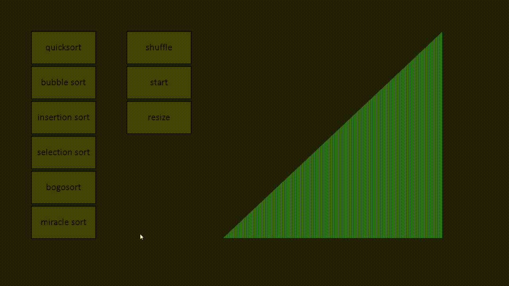

# Sort Visualizer
Sort Visualizer is an app made with SDL2 in C++ to show how different algorithms sort a list

# Important note
The time the app takes to order the list doesn't accurately reflect the algorithm's speed, if you want to know the actual time complexity of the algorithms read [Time complexity](#Time-complexity)

# The sorting algorithms  
The algorithms used in the app are:  
* Quick sort
* Bubble sort  
* Insertion sort
* Selection sort
* Bogo sort
* Miracle sort

# Time complexity
Here I'll be listing every algorithm's time complexity, if you want to learn more about each algorithm, you can access it by clicking the algorithm's name 
- ## [Quick sort](https://www.geeksforgeeks.org/time-and-space-complexity-analysis-of-quick-sort/)
  Best case: O(n log n)  
  Average case: O(n log n)  
  Worst case: O(n^2)

- ## [Bubble sort](https://www.geeksforgeeks.org/time-and-space-complexity-analysis-of-bubble-sort/)
  Best case: O(n)  
  Average case: O(n^2)  
  Worst case: O(n^2)

- ## [Insertion sort](https://www.geeksforgeeks.org/time-and-space-complexity-of-insertion-sort-algorithm/)
  Best case: O(n)  
  Average case: O(n^2)  
  Worst case: O(n^2)

- ## [Selection sort](https://www.geeksforgeeks.org/time-and-space-complexity-analysis-of-selection-sort/)
  Best case: O(n^2)  
  Average case: O(n^2)  
  Worst case: O(n^2)  
  
- ## [Bogo sort](https://www.geeksforgeeks.org/bogosort-permutation-sort/)
  Best case: O(n)  
  Average case: O(n n!)  
  Worst case: O(?)  
  
- ## [Miracle sort](https://www.thecshandbook.com/Miracle_Sort)
  Miracle sort is a joke algorithm which does nothing, but theoretically, if given infinite time, enough bit flips would occur for the list to sort on its own.  
  Best case: O(?)  
  Average case: O(?)  
  Worst case: O(?)  

