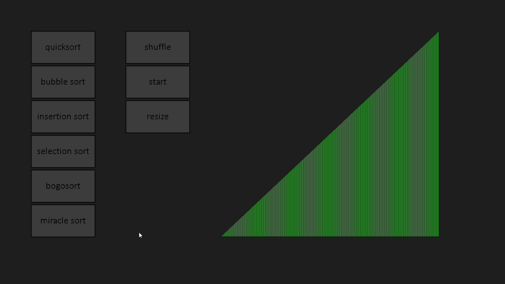

# Introduction  
this is an app i made using SDL2 to show how diffrent algorithms sort a list

# Important note
The time the app takes to order the list doesn't accurately reflect the algorithm's speed, if you want to know the actual time complexity of the algorithms read [Time complexity](#Time-complexity)

# The sorting algorithms  
The algorithms used in the app are:  
* Quick sort
* Bubble sort  
* Insertion sort
* Selection sort
* Bogo sort
* Miracle sort

# Time complexity
Here i'll be listing every algorithm time complexity, if you want to learn more about each algorithm you can access it by clicking the algorithm name 
- ## [Quick sort](https://www.geeksforgeeks.org/time-and-space-complexity-analysis-of-quick-sort/)
  Best case: O(n log n)  
  Average case: O(n log n)  
  Worst case: O(n^2)

- ## [Bubble sort](https://www.geeksforgeeks.org/time-and-space-complexity-analysis-of-bubble-sort/)
  Best case: O(n)  
  Average case: O(n^2)  
  Worst case: O(n^2)

- ## [Insertion sort](https://www.geeksforgeeks.org/time-and-space-complexity-of-insertion-sort-algorithm/)
  Best case: O(n)   
  Average case: O(n^2)   
  Worst case: O(n^2)   
  
  Best case: O(n) 
  Average case: O(n^2) 
  Worst case: O(n^2) 

- ## [Selection sort]()
  Best case: O()
  Average case: O()
  Worst case: O()
  
- ## [Bogo sort]()
  Best case: O()
  Average case: O()
  Worst case: O()
  
- ## [Miracle sort]()
  Best case: O()
  Average case: O()
  Worst case: O()

# A video from the app

